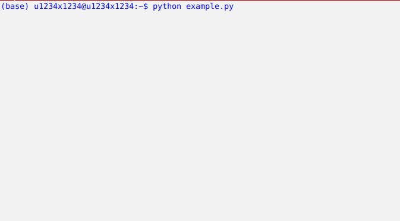

<div align="center" text-align="center">
  
  <h2> itertab: pretty printed table </h2>
</div>

- [Description](#description)
- [Usage](#usage)
- [Installation](#installation)

## Description

**itertab** is a pretty printed table with cell highlighting and automatic relative difference calculation.

The main purpose of this package is a basic understanding of the learning process (or any other iterative processes), without leaving the terminal and not relying on more advanced metric loggers (such as [Tensorboard](https://www.tensorflow.org/guide/summaries_and_tensorboard))


## Usage

Suppose you have a python script `example.py` with the following content:

```python
import time
import numpy as np
from itertab import PrettyTable

table = PrettyTable()
for epoch in range(15):
    metrics = {
        'epoch': epoch,
        'train': {
            'Train_Accuracy': np.random.uniform(),
            'Train_LogLoss': np.random.uniform(),
        },
    }
    table.add_row(metrics)
    table.clear_screen_and_print()

    time.sleep(0.3)
```

If you run `example.py` in the terminal you will get output similar to the one above.

## Installation

```bash
pip install git+ssh://git@github.com/u1234x1234/itertab.git
```
